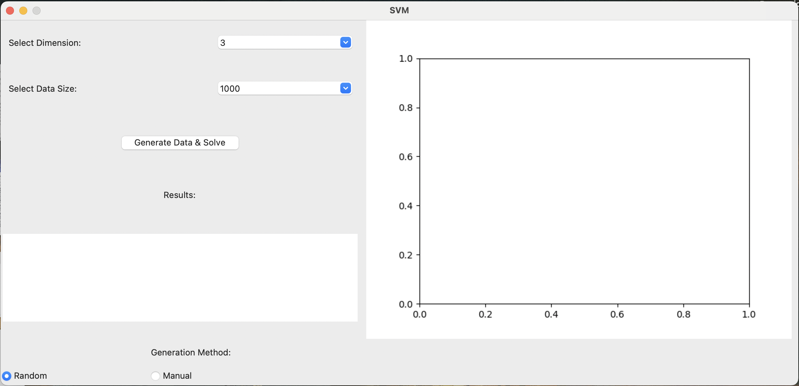

# SVM-GUI-SMO

+ `cvxopt_solver.py`: Invokes the quadratic programming solver from cvxopt for efficient problem-solving, primarily used as a benchmark for solving efficiency.

+ `smo_solver.py`: The main solving class `SVM` based on SMO algorithm.

+ `solve_with_smo.py`: Executes the solving class for SVM problem-solving and result visualization via a Python file in the command line.

+ `SVM_GUI.py`: A SVM problem-solving GUI program created using the Tkinter library, based on the authored solving algorithm.

## 1 `cvxopt_solver.py`

Adjust the feature dimensions (`n`) and quantity (`N`) around lines 74-75 to customize the problem. Save and run the file for solving; utilizes cvxopt's quadratic programming solver.

## 2 `solve_with_smo.py`

Similarly, customize feature dimensions (`n`) and quantity (`N`) around lines 36-37. Save and run the file to solve the problem; employs the solving class `SVM` authored by me.

## 3 `SVM_GUI.py`

(Running with the authored solving class) Launch the application:

- **Select Dimension:** Dropdown to choose data dimension (integer between 3 and 6).
- **Select Data Size:** Dropdown to select dataset size (1e3, 1e4, 1e5, 1e6).
- **Generation Method:** Choose data generation method, either "Random" or "Manual". Clicking "Manual" reveals two input boxes on the right.

- **Enter w (eg: 1,2,3):** Appears only in manual mode, for entering the w vector.
- **Enter b:** Appears only in manual mode, for entering the scalar b.
- **Generate Data & Solve:** Button to generate data (in Random mode) and solve the SVM problem.
- **Results:** Text box displaying the real hyperplane's `wb`, SVM-calculated optimal hyperplane's `wb`, and the elapsed time (in seconds).
- **Matplotlib_Frame:** (on the right) Displays the drawn dataset and the solved hyperplane after solving.

**Note:**

- In manual input mode, ensure the entered w vector length matches the selected dimension, and use commas for separation; otherwise, an error message will be displayed.
- If the input is invalid or erroneous, the application will show an appropriate error message dialog.
